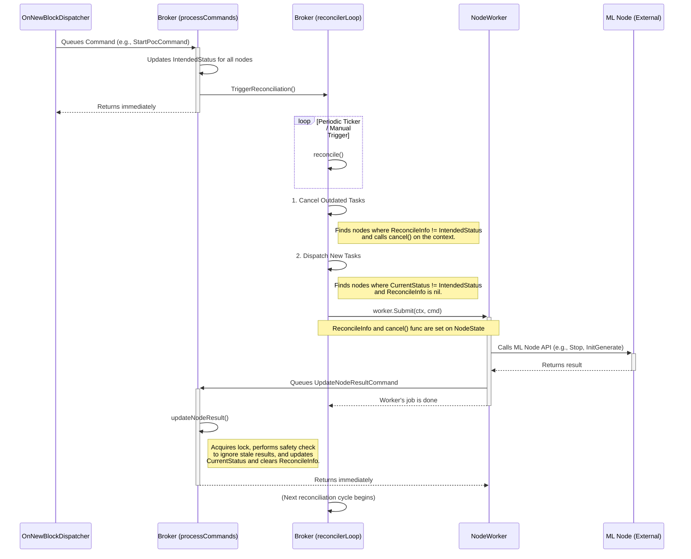

# Broker Architectural Overview

The `broker` package implements a non-blocking, concurrent controller pattern to manage the state and lifecycle of distributed machine learning nodes. Its core responsibility is to ensure that the actual state of each node converges to the state intended by the network's current phase (e.g., `Inference`, `PoC Generate`, `PoC Validate`).

The architecture is designed around the following key principles:

1.  **Hybrid Command and State-Driven Model**: The system uses a two-level approach.
    *   **Imperative Commands**: External actors, like the `OnNewBlockDispatcher`, issue explicit commands (e.g., `StartPocCommand`, `InitValidateCommand`) to the broker in response to specific blockchain events.
    *   **Declarative State Machine**: These commands are handled by the broker's command processor, which translates them into a declarative state by setting an **`IntendedStatus`** and **`PocIntendedStatus`** on the relevant nodes. The broker's sole long-term goal is to make the node's **`CurrentStatus`** and **`PocCurrentStatus`** match this intended state.

2.  **Asynchronous Reconciliation Loop**: A central, continuously running goroutine, the `reconcilerLoop`, is the heart of the system. It periodically checks the state of all nodes, but can also be manually triggered for immediate action via the `TriggerReconciliation()` method. This loop is the only component that initiates state-changing actions on nodes. This design avoids complex, event-driven race conditions and makes the system's behavior predictable. A manual trigger is typically issued after a command has been processed to ensure the system reacts quickly to changes in the nodes' intended state.

3.  **Thread-Safe State Management**: All access to the shared `nodes` map and their state is protected by a `sync.RWMutex`, ensuring that reads and writes from different goroutines are safe.

4.  **Idempotent, Cancellable Worker Tasks**: All long-running operations (like calling a node's API) are executed by dedicated `NodeWorker` goroutines.
    *   **Cancellable**: Every task is associated with a `context.Context` that can be cancelled. The `reconcilerLoop` intelligently cancels outdated tasks (e.g., if a node's `IntendedStatus` changes while a previous reconciliation is in flight).
    *   **Atomic State Updates**: Workers **never** modify the shared `NodeState` directly. Upon completion, failure, or cancellation, a worker queues a `NodeResult` back to the broker's main command processor. This handler is the single source of truth for finalizing state transitions, which prevents race conditions and ensures that results from stale/cancelled tasks are safely ignored.

5.  **Non-Blocking API**: All commands sent to the broker are fast, non-blocking operations. They either update the `IntendedStatus` and trigger the reconciler or queue a result for processing, ensuring the command processor remains responsive.

---

### TODOs:

- [ ] ...

### UML Sequence Diagram

