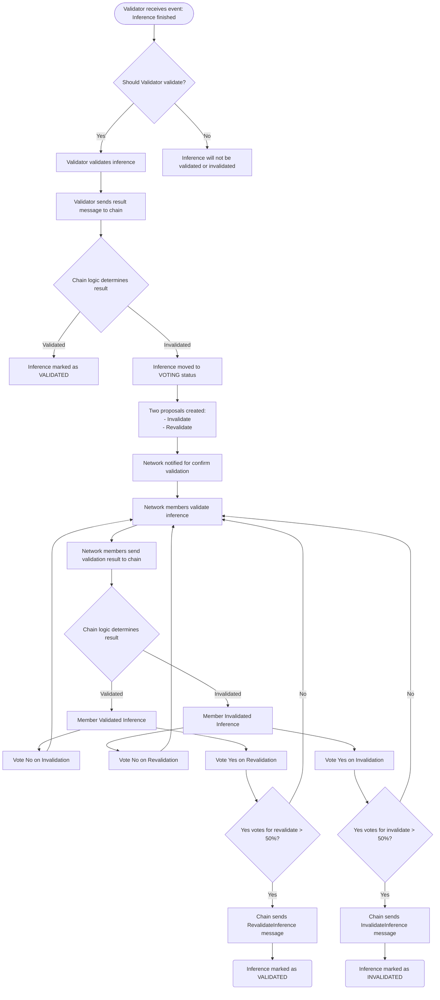

# Voting
Voting has two levels. Governance voting and operational voting.

### Governance Voting
This is voting for changing the "big" parameters, such as inflation rate, rewards and punishments for bad inferences, length of Epochs, etc. Voting period is likely to be days.

It is not implemented yet. We plan to use the x/gov module from the Cosmos SDK.

### Operational Voting
Operational voting is voting on short lived proposals when something seems wrong. Voting period is minutes. For example:

1. An inference does not appear to be using the right model or parameters
2. A PoC does not appear to be valid
3. ?

This is implemented for inference validation, and will be implemented for PoC validation shortly. It leverages the x/group module, with the results of each PoC creating a new group with the weights from the period.

### Diagram
Below is a Mermaid diagram of the inference validation voting process:

