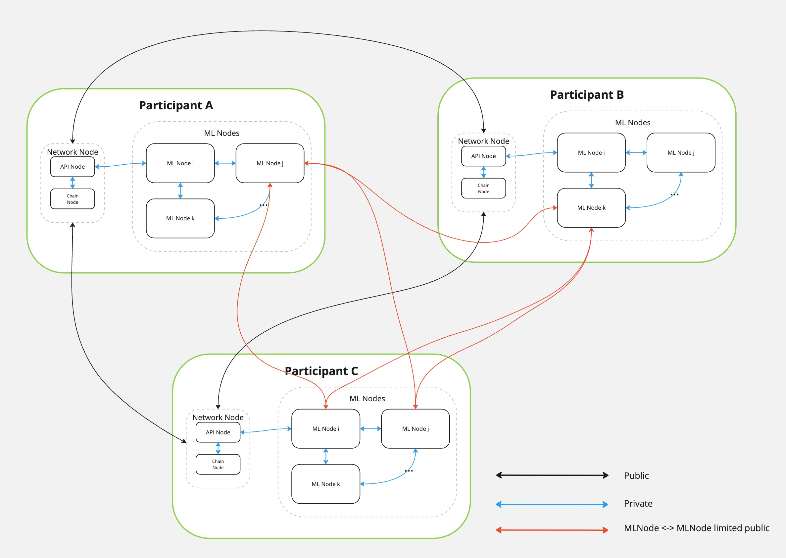

# MLNode for Decentralized AI Network

## Initial Setup

### Prerequisites

For testing and running integration tests, you need to have `docker` and `nvidia-container-toolkit` installed.  
To set up development environment, you need to install `poetry` and `make`.


### Setup environment variables

Main environment variables will be placed in the `.env` file. 
Also, each package might have its own environment variables in the `packages/<package_name>/.env` file.


To create template environment files, run:
```
make setup-envs
```

Then you need to fill these files with the actual values. 
At the moment, you need to modify only root `.env` file.

### Setup dev environment

You can set up development virtual environment `.venv` in the root directory which will have all dependencies for all packages installed. 
It is quite useful during cross-package development and to allow proper IDE autocompletion.

```
make setup-dev-env
```

Then you can activate the virtual environment with:
```
source .venv/bin/activate
```

## Repository structure

The project is using the poetry package manager. Code is separated into several logical packages:

- `common`: common utilities, shared between all packages
- `pow`: contains all logic and routes for the Proof-of-Work procedure
- `train`: contains code for training procedure
- `api`: API server, merge routes from all services and expose as a single REST API. Container for `api` is used to deploy **MLNode**.

We separated each package for easier development and testing. 
Each package has its own `Makefile` for building, testing, etc.  
Also, each package has its own unit and integration tests.  

For integration with the network, each package has to provide FastAPI routes. 
These routes are registered then in the `api` package.

`api` package is the only service which will be integrated with the network. 
Integration tests of `api` package might run some of the `train` and `pow` integration tests to make sure that all services work together.


## Testing

Each project might have 3 types of tests:
- unit tests
- unit tests with GPU
- integration tests

To run all tests in containers you can use `make tests` command.


### Unit tests

Unit tests are located in the `packages/<package_name>/tests/unit` directory of each package.
They are using `pytest` framework.

Unit tests must not require any GPU resources and also should be quite fast to run.

To run unit tests for all packages you can use:
- `make unit-tests` command to run tests in container
- `make unit-tests-local` to run tests locally

Also you can run them for specific package with the same commands.


### Unit tests with GPU

Unit tests with GPU are located in the `packages/<package_name>/tests/unit-gpu` directory of each package.
They are also using `pytest` framework.

These tests are using GPU resources and require it to be available on the machine. 
At the same time, we still plan to have them work locally without container and work quite fast to speed up the development.

To run unit tests with GPU for all packages you can use:
- `make unit-tests-gpu` command to run tests in container
- `make unit-tests-gpu-local` to run tests locally

Also you can run them for specific package with the same commands.


### Integration tests

Integration tests are located in the `packages/<package_name>/tests/integration` directory of each package.
They are using `pytest` framework.

Integration tests are using `docker-compose` to start the set of services and run the tests on them. 
They are using real models and data to provide the most realistic tests.  
They cannot be run outside of a container and might require a lot of time.

To run integration tests for all packages you can use:
- `make integration-tests` command to run tests in container

Also you can run them for specific package with the same commands.


## Release

To create and publish a new release, you can use the following Make targets:

- `build-release` – builds the Docker image for **MLNode** based on `packages/api/Dockerfile`
- `push-release` – pushes the versioned Docker image to `ghcr.io/gonka-ai/mlnode`
- `push-latest` – tags the same image as `latest` and pushes it to the registry
- `release` – runs all tests, builds and pushes the Docker image, creates a new Git tag in the format `release/v<version>`, and pushes that tag to the repository
- `release-latest` – does everything that `release` does, plus tags and pushes the `latest` image

### To release a new version:

```
VERSION=<version> make release
```

<version> should be in format `X.Y.Z`. It also might have `-alphaN`, `-betaN`, etc. suffixes.  


That command will:
1. Run all tests (unit, GPU, and integration)
2. Build the Docker image with the provided version (or `git describe --always` if not provided)
3. Push the image to `ghcr.io/gonka-ai/mlnode:<version>`
4. Create and push a Git tag named `release/v<version>`

If you also want to update the `latest` tag, use:

### To release the latest version:

```
VERSION=<version> make release-latest
```

At the moment, all the images are pushed to the `ghcr.io/gonka-ai/mlnode` registry.  
Also, they all are based on one of `gcr.io/decentralized-ai/vllm:<version>` images.  


## Architecture

The `api` project represents **MLNode** server of the decentralized network. 
Each participant in the network has only one **Network Node** but might have multiple **MLNodes**.  

**MLNode** handles all the logic related to:
- training of the models
- inference of the models
- Proof-of-Compute procedure

Only that service has access to GPU resources.

Each **MLNode** has its own REST API, and it's fully managed by its owner - **Network Node**.
The REST API of the **MLNode** is not intended to be accessible from outside the private network.

In some cases, different **MLNodes** from different participants might need to communicate with each other. Performance of the communication is crucial and we have to enable it directly, without intermediate **Network Node**. 

For that, **MLNode** might have opened some ports for TCP connections. Those ports accept data strictly from the known **MLNodes**, which are involved in the same task.
To accept data, **MLNode** needs to have the public key of the sender, which is provided via REST API by the **Network Node**. The **MLNode** checks the data signature and, if it does not recognize the sender, it rejects the connection.




*Not all the network nodes are connected to each other at the image. But in some cases, they might have every-to-every connections.*


## Contributing

To contribute to the project you need to follow the steps below:

1. Fork the repository
2. Create a new branch
3. Make your changes and commit them
4. Push your changes to the branch
5. Create a pull request

Your code should be covered by unit tests and integration tests.  
All new features should have unit tests.  
Integration tests are optional but recommended.

All new features should be documented and described in the pull request.

All tests should be passed before merging.


## License

See the [LICENSE](LICENSE) file for details.
