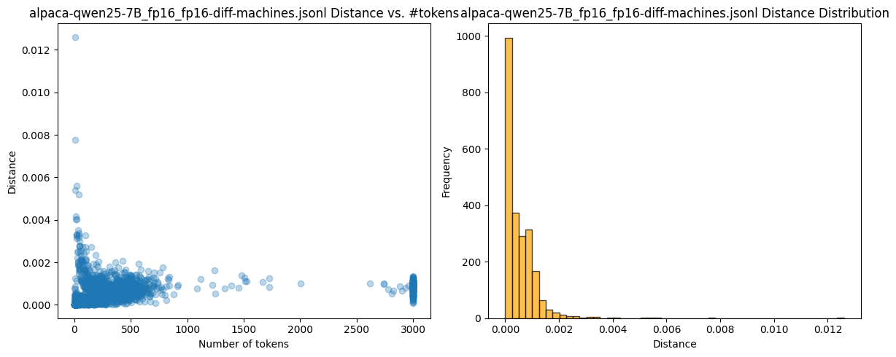
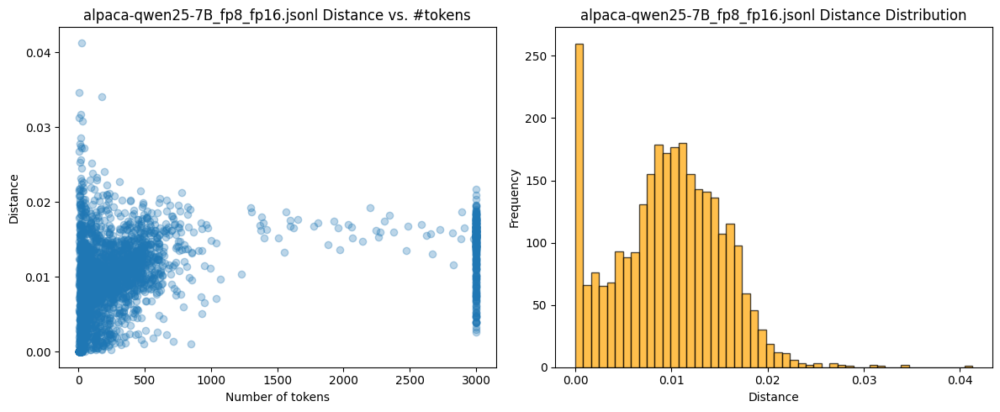
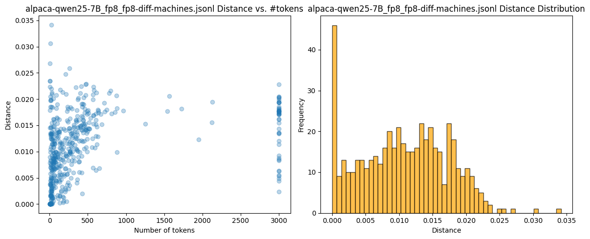
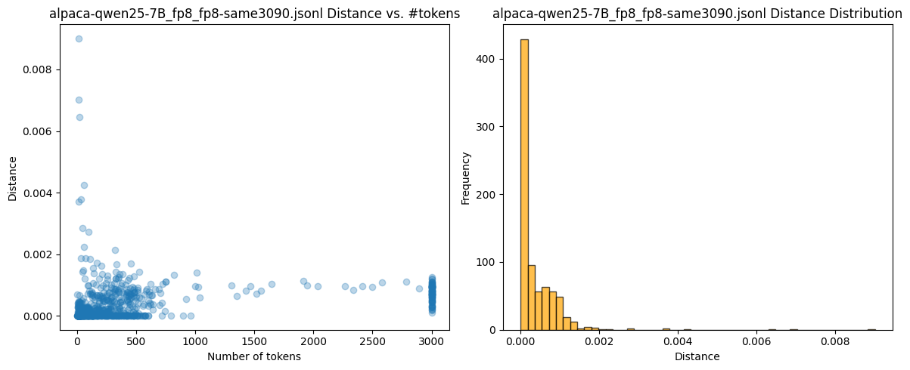
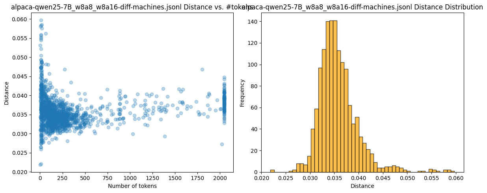
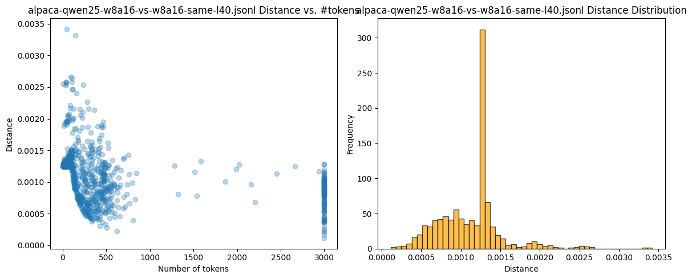
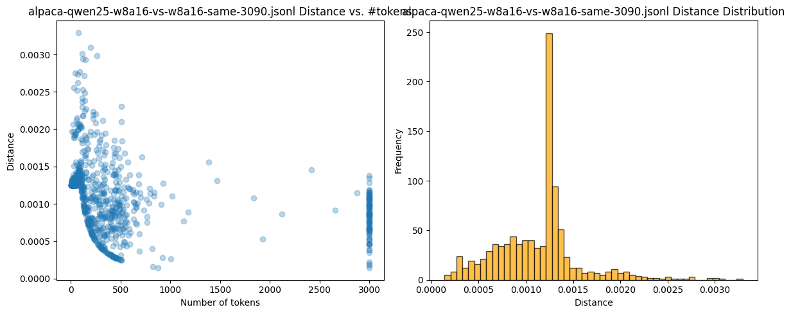
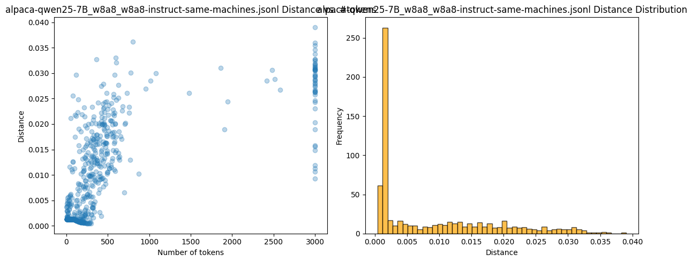

# Inference Validation

Now, inference validation checks whether two token–probability distributions match **at every position**.

## Additional Part

### 1. Prover

1. Generate a token sequence  

   $$
     [\,t_1,\, t_2,\, \dots,\, t_N\,].
   $$

2. For each position $i \in \{1,\dots,N\}$, record the top-$k$ candidate tokens and their probabilities:

    ```json
    {
        "i": {
        "t_i1": p_i1,
        "t_i2": p_i2,
        ...
        "t_ik": p_ik
        }
    }
    ```

Collecting this for every $i$ forms the **inference artifact**.

### 2. Validator

1. Re-generate **the same** token sequence

   $$
     [t_1, t_2, \dots, t_N].
   $$

2. Compute probabilities for the same top-$k$ candidates:

   ```json
   {
     "i": {
       "t_i1": p_i1,
       "t_i2": p_i2,
       ...
       "t_ik": p_ik
     }
   }
   ```

3. Compare the two distributions using the average distance

   $$
     \frac{1}{N}\sum_{i=1}^{N}
     \operatorname{dist}(p_{i1},\,\dots,\,p_{ik}).
   $$

### 3. Limitation — Pre-fill Attack

1. An attacker (prover) uses a **cheap model** to generate the sequence
   $[t_1,\,\dots,\,t_N]$.

2. The attacker then employs the **full model** to produce the proof (probabilities) expected by the validator.

### 4. Proposed Mitigation

Introduce an additional metric based on the joint probability

$$
  P(t_1,\,t_2,\,\dots,\,t_N \,|\, \text{proof}).
$$

We need to define this metric in the following way:
$$
  P > \text{threshold} \Rightarrow \text{OK}
$$

$$
  P < \text{threshold} \Rightarrow \text{sequence likely generated from different models}
$$

## Experiments

**Model**: `Qwen2.5-7B-Instruct`  
**Default sampling parameters**:
 - n=1
 - presence_penalty=0.0
 - frequency_penalty=0.0
 - repetition_penalty=1.2
 - temperature=0.6
 - top_p=0.8
 - top_k=20
 - min_p=0.0

**GPUs**:
1. NVIDIA RTX 3090
2. NVIDIA L40S

**Distance function between distributions**:

```python
def token_distance2(
    inf_position_logprobs: PositionResult,
    val_position_logprobs: PositionResult
):
    """
    Calculate distance between two token probability distributions at a single position.
    
    Args:
        inf_position_logprobs: Inference position log probabilities
        val_position_logprobs: Validation position log probabilities
    
    Returns:
        tuple: (distance, number_of_matches)
    """
    dist = 0.0
    n_matches = 0

    if not val_position_logprobs.logprobs:
        return len(inf_position_logprobs.logprobs), 0

    sorted_logprobs = sorted(val_position_logprobs.logprobs.values())
    
    if len(sorted_logprobs) >= 2:
        min_val_logprob_1 = sorted_logprobs[0]
        min_val_logprob_2 = sorted_logprobs[1]
    else:
        min_val_logprob_1 = sorted_logprobs[0]
        min_val_logprob_2 = min_val_logprob_1 - 1.0

    for token, inf_logprob in inf_position_logprobs.logprobs.items():
        if token in val_position_logprobs.logprobs:
            val_logprob = val_position_logprobs.logprobs[token]
            n_matches += 1
        else:
            val_logprob = min_val_logprob_1 - (min_val_logprob_2 - min_val_logprob_1)

        denom = 1e-10 + abs(inf_logprob) + abs(val_logprob)
        dist += abs(inf_logprob - val_logprob) / denom / 2.0

    return dist, n_matches

def distance2(inf_result: Result, val_result: Result):
    """
    Calculate overall distance between two inference results.
    
    Args:
        inf_result: Inference result
        val_result: Validation result
    
    Returns:
        tuple: (average_distance, matches_ratio)
    """
    if not _check_match(inf_result, val_result):
        return -1, -1

    total_dist = 0
    total_n_matches = 0
    for inf_position, val_position in zip(inf_result.results, val_result.results):
        dist, n_matches = token_distance2(inf_position, val_position)
        total_dist += dist
        total_n_matches += n_matches
    
    matches_ratio = total_n_matches / (len(inf_result.results)*len(inf_result.results[0].logprobs))
    total_dist = (total_dist + 1.0) / (max(100, len(inf_result.results))*len(inf_result.results[0].logprobs) + 1.0)
    return total_dist, matches_ratio
```

### FP16 vs FP16

**Setup**: `Qwen2.5-7B-Instruct` deployed on both servers via vLLM 0.9.1, dtype = fp16 and default params

**Generate**: NVIDIA RTX 3090: default params  
**Validate**: NVIDIA L40S: default params



**Result**: Most distances are under 0.002

### FP8 vs FP16

**Setup**: `Qwen2.5-7B-Instruct` deployed on both servers via vLLM 0.9.1, dtype = fp16

**Generate**: NVIDIA RTX 3090: `--quantization fp8`  
**Validate**: NVIDIA L40S: default params



**Result**: Most distances are about 0.02 - fraud is clearly detectable

### [Problem]: FP8 vs FP8: Different machines

**Setup**: `Qwen2.5-7B-Instruct` deployed on both servers via vLLM 0.9.1, dtype = fp16

**Generate**: NVIDIA RTX 3090: `--quantization fp8`  
**Validate**: NVIDIA L40S: `--quantization fp8`



**Result**: Most distances are about 0.02 - this clearly indicates significantly different models

### FP8 vs FP8: Same machine

**Setup**: `Qwen2.5-7B-Instruct` deployed on both servers via vLLM 0.9.1, dtype = fp16

**Generate**: NVIDIA RTX 3090: `--quantization fp8`  
**Validate**: NVIDIA RTX 3090: `--quantization fp8`



**Result**: Most distances are under 0.002

### Key Finding

We clearly see that `--quantization fp8` can lead to significantly different inference results in terms of our comparison. This difference depends on the available GPUs:
- If FP8 computation is supported → `w8a8` quantization is used
- If FP8 compute is not supported → `w8a16` quantization is used (via `marlin` kernel)

### w8a16 vs w8a16: Different machines

**Setup**: `Qwen2.5-7B-Instruct` deployed on both servers via vLLM 0.9.1, dtype = fp16

**Generate**: NVIDIA L40S: `RedHatAI/Qwen2.5-7B-quantized.w8a16`  
**Validate**: NVIDIA RTX 3090: `RedHatAI/Qwen2.5-7B-quantized.w8a16`


### w8a8 vs w8a16: Different machines

**Setup**: `Qwen2.5-7B-Instruct` deployed on both servers via vLLM 0.9.1, dtype = fp16

**Generate**: NVIDIA L40S: `RedHatAI/Qwen2.5-7B-quantized.w8a8`  
**Validate**: NVIDIA RTX 3090: `RedHatAI/Qwen2.5-7B-quantized.w8a16`



**Result**: We clearly detect this difference

**Conclusion**: We must specify quantization precision in a way that prevents the inference engine from making implicit decisions

### w8a16 vs w8a16: Same machine L40

**Setup**: `Qwen2.5-7B-Instruct` deployed on both servers via vLLM 0.9.1, dtype = fp16

**Generate**: NVIDIA L40S: `RedHatAI/Qwen2.5-7B-quantized.w8a16`  
**Validate**: NVIDIA L40S: `RedHatAI/Qwen2.5-7B-quantized.w8a16`




**Result**: Same model

### w8a16 vs w8a16: Same machine 3090

**Setup**: `Qwen2.5-7B-Instruct` deployed on both servers via vLLM 0.9.1, dtype = fp16

**Generate**: NVIDIA 3090: `RedHatAI/Qwen2.5-7B-quantized.w8a16`  
**Validate**: NVIDIA 3090: `RedHatAI/Qwen2.5-7B-quantized.w8a16`



**Result**: Same model

### w8a8 vs w8a8: Same machine L40

**Setup**: `Qwen2.5-7B-Instruct` deployed on both servers via vLLM 0.9.1, dtype = fp16

**Generate**: NVIDIA L40S: `RedHatAI/Qwen2.5-7B-quantized.w8a8`  
**Validate**: NVIDIA L40S: `RedHatAI/Qwen2.5-7B-quantized.w8a8`



**Result**: We clearly see that there might be some issues here. Investigation shows that most of these cases involve hallucination with repetition at the end (TODO: need more research)

# [WIP] Longer Plan: Seed-based Top-k Proof

Most decoding algorithms (`top-k`, `top-p`) sample only from the $k$ highest-probability tokens, typically $k \approx 20$.

By logging those $k$ tokens and fixing the RNG seed per request, we can replay the whole sampling path and then compare distributions.

### 1. Prover

1. **Seed selection**:
   ```python
   user_seed = 42            # supplied by caller (already supported by vLLM)
   seq_uuid = "478e1c3c-…"   # fresh UUID per request
   run_seed = SHA256(user_seed || seq_uuid)
   ```

2. Generate the sequence with `run_seed`.
3. For every position $i = 1\ldots N$ record:
   ```json
   {
     "top_k": ["▁the", "▁a", "▁an", …],   // length = k (e.g. 20)
     "logits": [-0.45, -1.21, -2.99, …],  // same order as top_k
     "chosen": "▁the"
   }
   ```

4. **Inference artifact**:
   ```json
   {
     "seed": "0x9e3b…",      // run_seed
     "k": 20,
     "positions": [ … ]      // one entry per token position
   }
   ```

### 2. Validator

1. Initialize RNG with `artifact.seed`.
2. **Sequence check** (cheap):
   For each position $i$:
   - Sample an index $j \in [0,k-1]$ with the RNG.
   - Assert: `artifact.positions[i].chosen == artifact.positions[i].top_k[j]`
   - Any mismatch → reject.

3. **Distribution check** (model call):
   Run the reference model, fetch logits for the same `top_k`, and compute:
   $$D = \frac{1}{N}\sum_{i=1}^{N} \operatorname{dist}(\text{logits}_i)$$
   Accept if $D < \varepsilon$.

### 3. Why it works

- **Blocks the pre-fill attack** – an attacker with a cheaper model cannot guess the full-model top-$k$ sets needed for the sequence check.
- **Lightweight** – replay uses only RNG + logged $k \approx 20$ tokens per step.
- **Two-layer defense**:
  1. **Sequence check**: verifies $[t_1,\dots,t_N]$ truly comes from the published artifact (no heavy compute).
  2. **Distribution check**: ensures the artifact is consistent with the validator's own model.