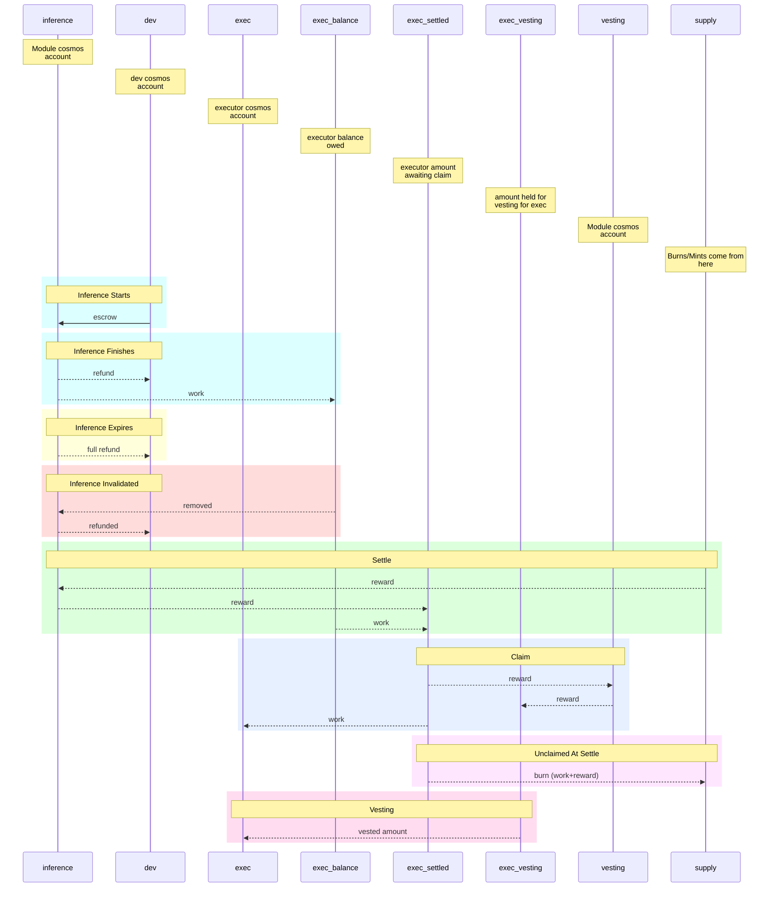
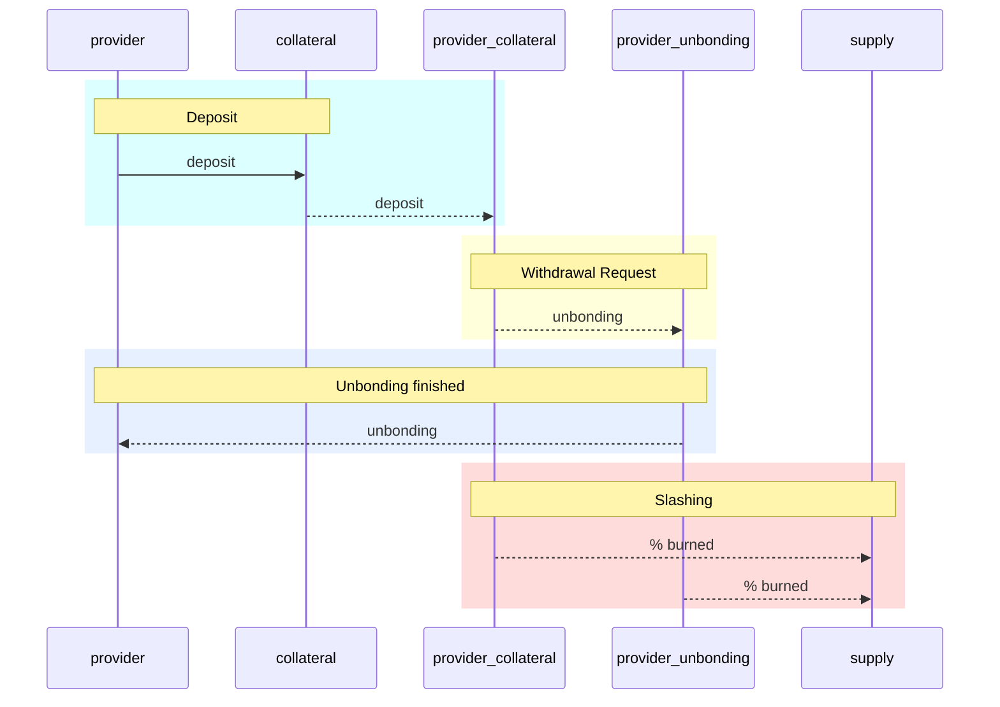

# Flows as of Tokenomics v2
Rough chart of funding flows as of Tokenomics v2.

In all charts, the accounts with underscores are "subaccounts", the others are full Cosmos accounts.
## Inferences

## Collateral
