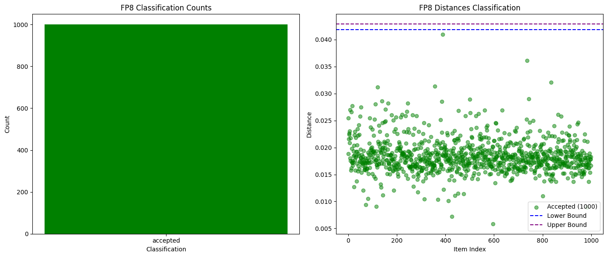
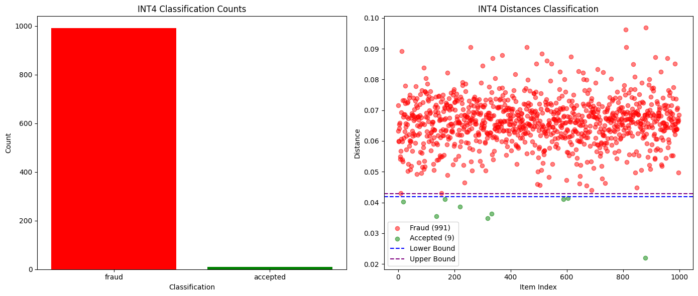
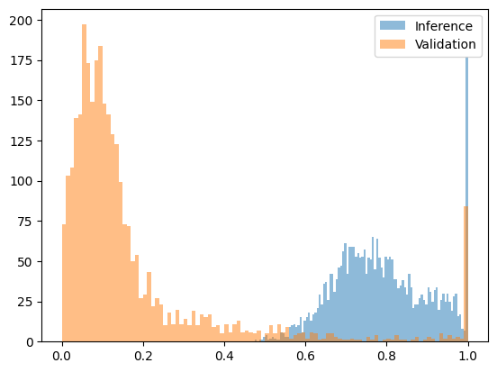
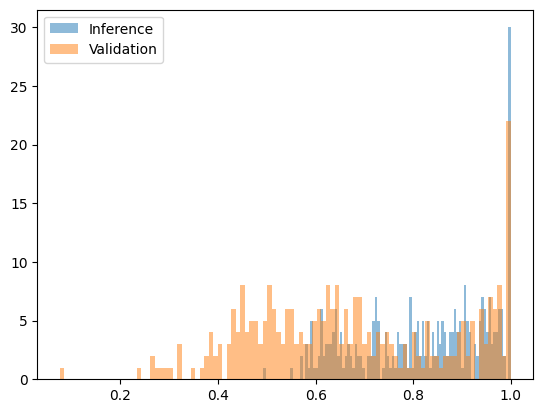

# Inference Validation Proposal

## Problem Definition

In decentralized inference systems, we need a verification process confirming that an executer actually used the claimed model and parameters to generate a given text sequence. Without validation, executers can cheat by using cheaper or modified models while claiming to use expensive, high-quality models (for example int4 quantization is used instead of fp8).

The core challenge: **How do we verify that a specific token sequence for the prompt was generated by a specific model with specific parameters?**

## Current Implementation and Vulnerabilities

Currently, inference validation compares whether two token–probability distributions are close enough **at every position**.

Details of the current implementation can be found [here](https://github.com/gonka-ai/vllm/tree/gonka/vllm-0.9.1).

### Executer

1. Generates a token sequence $[t_1 \, t_2 \, \dots \, t_N]$ for the given prompt.

2. For each position $i \in \lbrace 1,\dots,N \rbrace$, records the top-k (e.g. `k=5`) candidate tokens and their probabilities:

$$ A_i = \lbrace t^i_1: p^i_1, t^i_2: p^i_2,\dots t^i_k: p^i_k \rbrace $$

Collecting this for every position $i$ forms an **inference artifact** $A = [ A_1, \dots, A_N ] $.

### Validator

1. Re-generates **the same** token sequence $[t_1, t_2, \dots, t_N]$.

2. Computes probabilities for the same top-k candidates:

$$
   \tilde{A}_i = \lbrace t^i_1: \tilde{p}^i_1, t^i_2: \tilde{p}^i_2,\dots t^i_k: \tilde{p}^i_k \rbrace
$$

The new artifact becomes: $\tilde{A} = [ \tilde{A}_1, \dots, \tilde{A}_N ] $.

3. Compares the two distributions using the average distance:

$$
   \frac{1}{N}\sum_{i=1}^{N}
   \text{dist}(A_i, \tilde{A}_i).
$$

Note: The described function is quite noisy for short outputs. In practice, the following aggregation is used:
```
def position_dist(
    inf_top_tokens: Dict[str, float],
    val_top_tokens: Dict[str, float]
):
    dist = 0.0
    for token in inf_top_tokens.keys():
        inf_logprob = inf_top_tokens[token]
        val_logprob = val_top_tokens[token]

        denom = 1e-10 + abs(inf_logprob) + abs(val_logprob)
        dist += abs(inf_logprob - val_logprob) / denom

    return dist

def distance2(inf_result: Result, val_result: Result):
    total_dist = 0
    for inf_position, val_position in zip(inf_result.results, val_result.results):
        dist = position_dist(inf_position, val_position)
        total_dist += dist
    
    return (total_dist + 1.0) / (max(100, len(inf_result.results))*len(inf_result.results[0].logprobs) + 1.0)
```

### What works well
The current implementation
- catches wrong model usage (e.g. `Qwen2.5-3B` vs `Qwen2.5-7B`)
- catches significant quantization differences in most cases. 

For example, if the chain agrees to deploy `Qwen3-32B` FP8 but a participant uses INT4 instead, our distance check would flag the corresponding inferences as fraudulent and punish the participant. 

In the plots below, all FP8 inferences are validated as honest (0 false positives, i.e. honest inferences marked as fraud), and 99% of INT4 inferences are correctly flagged as fraud. The small remainder of false negatives (fraudulent inferences accepted as honest) is acceptable as the cheating participant will still be caught and punished. Most importantly, the honest FP8 inferences won't be fraudulent, ensuring that honest participants running the claimed model will be rewarded accordingly.






### Vulnerability: Pre-fill Attacks

The current system remains vulnerable to **pre-fill attacks**: an executer can generate a sequence with a cheap model (even random) and then compute probabilities for that same sequence with the real model (single model pass, without token-by-token generation). 


For example, chain agrees to deploy `Qwen3-235B` with specified set of parameters. 

**Attack Process:**

1. Executer generates sequence using `Qwen2.5-3B`: `[Hello, world, how, are, you]`
2. Executer computes artifacts using `Qwen3-235B` for those exact tokens in a single inference pass: `[{Hello: 0.9, Hi: 0.05, Hey: 0.05}, ...]`
3. Executer submits `Qwen3-235B` probabilities as proof, claiming that inference is from `Qwen3-235B`

**Why it's dangerous:** The probabilities ARE from `Qwen3-235B`, making them look legitimate, but the sequence was generated cheaply (token-by-token generation from a small model and only a single inference pass from the real one).  

The attack requires single forward pass for the full `prompt_tokens+output_tokens` sequence instead of one-by-one generation of output tokens (KV-cache is used, so not all sequential passes are equally expensive). 

## Proposed Solution

> We need to modify our process to somehow bind the generated sequence with the distribution.

## Our Two-Step Solution

We propose a **two-step approach** to address this vulnerability:

1. **Quick Fix (Interim):** Perplexity check (PPL) - simple and can be implemented immediately
2. **Proper Fix (Long-term):** Two-stage validation system with reproducible sampling verification (in addition to current approach, we only verify that the sequence is sampled from the artifact step-by-step)

## Quick Fix: Perplexity (PPL)

While we develop the complete sequence verification system, we propose an immediate mitigation using **perplexity**.

### How Perplexity Check Works

Instead of only checking per-position probability distributions, we also validate the overall sequence likelihood using perplexity.

For the claimed model, compute per-token log-probs on the submitted sequence $t_{1:N}$.

**Perplexity (PPL) is:**
$$\text{PPL} = \exp\left(-\frac{1}{N}\sum_{i=1}^{N} \log p(t_i \mid t_{<i})\right)$$

**Validation rule:**
- $$\text{PPL} \leq \tau_{\text{PPL}} \Rightarrow \text{Accept}$$
- $$\text{PPL} > \tau_{\text{PPL}} \Rightarrow \text{Reject (sequence unlikely under claimed model)}$$

**Threshold definition:** $\tau_{\text{PPL}}$ is the maximum acceptable perplexity value for a sequence to be considered legitimate under the claimed model. This threshold is calibrated per model/quantization combination on held-out validation data to achieve a target false-reject rate.

**Implementation note:** Use log-space for stability; convert to PPL only once at the end.

### Effectiveness Against Different Attack Scenarios

#### Significantly Different Models (High Effectiveness)
Perplexity check works well when the attack uses much smaller models even with the same vocabulary. 

Below is a histogram of the joint probability $P(t_{1:N})$ for Qwen2.5-3B Alpaca (w8a16) to generate sequences while claiming they came from Qwen2.5-7B Base (w8a16). This probability relates to perplexity by $\text{PPL} = P^{-1/N}$, i.e., perplexity is the inverse of the geometric mean of the per-token probabilities (equivalently, $P = (1/\text{PPL})^N$). This transformation was done to fit results in $[0, 1]$ interval for easy visualization and selection of threashold. 



Setting a threshold around 0.2 for joint probability effectively prevents pre-fill attacks with high confidence, providing strong protection against economically motivated fraud attempts.

#### Similar-Sized or Quantized Models (Low Effectiveness)

Perplexity doesn't provide protection against attacks using similar models (e.g.: different quantization of the same model), as their sequence generation patterns are more comparable. For example, comparing Qwen2.5-7B Base w8a16 vs w8a8 shows minimal differences in joint probability distributions.



At the the same time, in such setup the attack becomes **economically pointless**. If models are similar, we're effectively doing almost full inference in the first phase (cheap model generates with KV cache), then a one-shot scoring pass on the claimed model (empty KV). Essentially:

- Phase 1 (similar `cheaper` model): $\approx 0.7-0.9 \times$ the compute of the claimed model’s normal generation for the same $N$ tokens.
- Phase 2 (claimed model, empty-KV scoring pass): as most most compute is spent at attention, let's make highly conservative lower bound estimate as 0.5 of the claimed model’s normal generation for the same $N$.

=> even with lower bound estimation, such attack turns out more expensive then real inference.


### Conclusion on Quick Fix

While perplexity check has limitations against similar-sized models, it serves as an effective interim solution because:
1. It prevents the most economically efficient attacks (using significantly cheaper models)
2. It doesn't generate false positives (when honest inference is marked as fraud), as visible on both plots. Legitimate sequences from the claimed models consistently fall within acceptable ranges

## Proper Fix: Two-Stage Validation System

For complete protection, we propose a **two-stage validation system** that definitively prevents pre-fill attacks.

### Stage 1: Sequence Check (Cheap)

Verify that the claimed token sequence was actually sampled from the provided artifact.
- **Purpose**: Bind tokens to RNG and artifact to make sampling fully verifiable to catch pre-fill attacks
- **Cost**: Minimal (RNG operations only)

### Stage 2: Distribution Check (Expensive)

Compare probability distributions between executer and validator   
- **Purpose**: Bind distributions to the model to catch wrong model usage and parameter/quantization drift.
- **Cost**: Requires full model inference

**Validation Flow**:
```
Input: Token sequence + Artifact → Sequence Check (if not pass) → Reject
                                      ↓ (if pass)
                                 Distribution Check → Accept/Reject
```

### Implementation Details

#### Executer Process

1. **Seed Generation**:
   ```python
   user_seed = 42                    # Provided by developer
   run_seed = SHA256(user_seed || inference_id_from_chain)
   ```

2. **Sequence Generation**:
   - Initialize model with specified parameters and quantization
   - Initiate RNG from `run_seed`
   - Generate token sequence: $[t_1, t_2, \dots, t_N\,]$ one by one using RNG:

   At each inference step $i$, the model produces a full probability distribution over the vocabulary (sometimes it is limited to distribution over $top_N$ tokens with highest probs):
      $A_{full} = \lbrace t^i_1: p^i_1, t^i_2: p^i_2,\dots t^i_k: p^i_k, t^i_{k+1}: p^i_{k+1}, \dots \rbrace$

   A token $t_i$ is sampled from this distribution using the RNG.
   The top-k tokens from $A_{full}$ and their probabilities are recorded in the artifact $A_i$. The final artifact also includes the `run_seed`.


#### Validator Process

**Stage 1: Sequence Check**
1. Initialize RNG with `run_seed`
2. For each position i:
   - Use RNG to sample a token from artifact's $A_i$ top-k list (i.e., `artifact.positions[i].top_k`), obtaining its index `sampled_index`.
   - Verify: `artifact.positions[i].chosen == artifact.positions[i].top_k[sampled_index]`
   - **Any mismatch leads to reject immediately**

**Stage 2: Distribution Check**
Exactly the same process we have implemented now.

### Storage Requirements

**What we store for verification:**
- Top-k probabilities (e.g. `k=5`): Token IDs + probabilities at each position (already stored on-chain)
- Request + Exact generated token sequence - already stored on-chain

